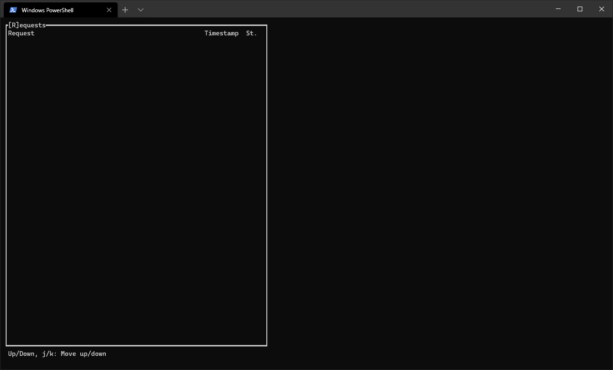

# Proxide
### HTTP2/gRPC Debugging Proxy



## Installation

```
cargo install proxide
```

## Usage

Run proxide listening on port `1234`, bridging connections to port `8888` and
using `my.proto` gRPC description to decode the traffic.

```
proxide monitor -l 1234 -t 8888 --grpc my.proto dependent.proto third.proto
```

## Status

**Proxide is currently under development**

The basic decoding works, but there are still few "production quality" features
missing.

- [x] Proxy arbitrary HTTP/2 traffic.
- [x] Decode gRPC communication.
  - [x] Support multiple proto-files and/or proto-file with `import` statements.
- [ ] Better TUI tooling.
  - [ ] Search/highlight support.
  - [ ] Clipboard integration.
    - [x] Well we got request/response exporting at least!
  - [ ] Follow communication streams.
  - [ ] Switch between different encoders manually (Raw, Headers, gRPC).
- [ ] Better support for corrupted/incomplete message display.
- [x] Import/Export session.
- [ ] Support streaming JSON/Protobuf/etc. output for graphical UI integration.
- [ ] Support TLS
- [ ] Support HTTP/1.x upgrades
- [ ] Support for acquiring stacktraces from local requests with thread-id
  headers.
- [ ] HTTP/1.x support

## License

Currently Proxide is covered under GPLv3 license. Proxide is partially
motivated to provide tooling for my day job. While I'm not expecting to be
assigned to develop Proxide features as part of my employment, I'm not
completely discounting that prospect, especially in relation to the TLS
support, for which I don't have any need for development purposes but which
would allow Proxide to be used to troubleshoot customer issues.

GPLv3 license should ensure those complex copyright issues won't cause problems
for Proxide remaining free. It is very likely I'll re-license the source under
Rust's usual MIT/Apache combination sometime in the future. The plan to move
onto MIT/Apache license also means any possible PRs needs to allow such
re-licensing.

I'm also up for spinning functionality off into separate library crates, if
there's bits that would benefit other crates (which is what happened with the
[protofish] crate).

[protofish]: https://github.com/Rantanen/protofish
